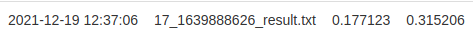

# WebLab 2

> 肖桐 PB18000037
>
> 高路尧 PB18071521
>
> [GitHub](https://github.com/TownShaw/WebLab)

# 1. Embedding

首先需要将 `entity_with_text.txt` 和 `relation_with_text.txt` 中的实体和关系转化为具有语义信息的向量。

这里我们使用的是 `gensim.Word2Vec` 类，来实现自动的无监督学习。得出的结果为每个 `id` 的语义信息，要得到每个实体 or 关系的语义信息，还需要将表征该实体 or 关系的所有 `id` 进行语义融合。这里我们采用了一种较简单方便的方法，即直接将所有 `id` 的语义向量取平均，来作为后续使用模型的 `Embedding` 层的初始 `Embedding` 矩阵。

**该部分实现在文件 `lab2/src/utils/utils.py` 的 `build_word2vec()` 函数中。**

# 2. TransE

[原论文](https://proceedings.neurips.cc/paper/2013/file/1cecc7a77928ca8133fa24680a88d2f9-Paper.pdf)

`TransE` 基于一个假设：对于头尾实体 `h, t` 以及关系 `r`，应该有 `h + r = t`。

因此 `TransE` 的目标就是对于一个正确的三元组 `(h, r, t)`，应当尽可能地减小 `h + r` 与 `t` 之间的距离，而对于一个错误的三元组 `(h, r, t)`，应当尽可能增大 `h + r` 与 `t` 之间的距离。这里距离的定义可以为 `L1` 范数，也可以为 `L2` 范数等等，这里我们选择 `L2` 范数。

因此算法的设计为，对于每一个正确的三元组 `(h, r, t)`，基于这个正确的三元组构造一个错误的三元组，比如随机替换掉头实体或者尾实体（不能两个同时替换），这就构造了一个错误的三元组。

接着计算正确三元组之间的距离，和错误三元组之间的距离，然后将这两个距离相减，再加上一个超参 `Margin` 并取 `ReLU`，就得到了一次训练的 `Loss` 函数。这里超参 `Margin` 用于表示正负例之间的距离。

最后再用 `SGD` 随机梯度下降算法来进行反向传播，来对 `Embedding` 层的参数来进行优化。

本地跑出来的最优结果为：

```python
Hit@1: 0.1479, Hit@5: 0.3038, Hit@10: 0.3741
```

**该部分实现在文件 `lab2/src/model.py` 文件的 `TransE` 类中。**

# 3. TransH

[原论文](https://persagen.com/files/misc/wang2014knowledge.pdf)

`TransH` 大部分与 `TransE` 类似，只有一处改进：

相较于 `TransE` 简单地认为对于每个三元组都应该有 `h + r = t`，`TransH` 认为为了应对“一对多”、“多对一”的情况，应该先将头尾实体 `h, t` 进行投影到 `r` 的超平面中，得到 `h', t'`，然后才有 `h' + r = t'`。

因此相较于 `TransE` 中存在的 `Entity Embedding` 和 `Relation Embedding`，`TransH` 中还会多一个 `Norm Embedding`，表示每个 `Relation` 向量所在的超平面。因此在计算三元组之间的距离时，需要多一个计算投影的步骤：

$h_\perp = h - w^Thw,\ \ t_\perp = t - w^Ttw$

其中，$w^T$ 为 `Norm Embedding` 矩阵中代表 `r` 所在超平面的单位向量。然后再以同样的方式构造错误三元组 `(h', r, t')`，然后同样计算 `h', t'` 在 `r` 所在超平面上的投影：

$h_\perp' = h' - w^Th'w,\ \ t_\perp' = t' - w^Tt'w$

最后使用 `L2` 范数来度量三元组之间的距离。

在 `Loss` 函数方面，相比于 `TransE`，`TransH` 多了两项：

1. 用于度量 `Entity Embedding` 范数的 `Loss`。
2. 用于度量 `Norm Embedding` 中正交程度的 `Loss`。

最后也是使用 `SGD` 即随机梯度下降法来进行反向传播，来对 `Embedding` 层的参数进行优化。

本地跑出来的最优结果为：

```python
Hit@1: 0.1829, Hit@5: 0.3282, Hit@10: 0.4024
```

提交到平台上的最优结果为：



**该部分实现在 `lab2/src/model.py` 文件的 `TransH` 类中。**

# 结果分析

可以看出 `TransH` 模型结果比 `TransE` 在各方面要好上几个百分点。

我们分析的可能原因是，因为 `TransH` 在进行利用假设 `h + r = t` 之前先做了投影，因此可能可以解决一些一对多或多对一的情况，比如假设 `h, t` 已经在 `r` 所在超平面内，且 `h + r = t`，则对于所有在 `r` 所处平面投影结果等于 `h` 的向量 `x` 而言，在经过 `TransH` 的投影之后得到 `x'`，都能够满足 `x' + r = t`，因此对于这类多对一的训练样例处理的较好。

而对于 `TransE` 而言，在以上情况中，若 `x` 不在 `r` 所在超平面内，则不会满足 `x + r = t`，这种多对一的训练样例若较多的话，则会对训练的效果产生反复的影响。

简而言之，`TransH` 相当于是对 `TransE` 进行了普适化，使之能够接受更真实（因为真实情况中一个实体极有可能与多个实体有相同的关系）、更普遍的情况，因此效果会比 `TransE` 更好。